# ADHD Superstars

 

## Overview

To create an app that encourages a positive mindset in the ADHD user by focusing on strengths and successes and minimising cognitive overload by narrowing focus on the top 3 most important tasks for the day. 

### Background

ADHD is a neurotypical developmental disorder characterised by an impairment of executive function (mental processes used to manage day-to-day life and attain goals). ADHD Ireland (https://adhdireland.ie/for-adults/adhd-in-adults/) share that adults with ADHD have problems in six main areas of executive functioning:

* Activation – Problems with organisation, prioritising, and starting tasks.
* Focus – Problems with sustaining focus and resisting distraction, especially with reading.
* Effort – Problems with motivation, sustained effort, and persistence.
* Emotion – Difficulty regulating emotions and managing stress.
* Memory – Problems with short-term memory and memory retrieval.
* Action – Problems with self-control and self-regulation.

Apps recommended by ADHD resources are often the same popular to-do list and reminder apps suitable for the general population and not tailored to ADHD. Here is a list for example:

https://www.additudemag.com/mobile-apps-for-adhd-minds/

### Project Goals

* Encourage a positive mindset at the start of the day by focusing on strengths, advice, wins and progress. 
* Optimise focus by requiring the user to clarify their top three priorities for the day.

## UX

### User Stories

Agreed:

* As a user, I need to see a daily reminder of an ADHD superpower/strength.
* As a user, I need to see a daily reminder of advice tailored to ADHDers.
* As a user, I need to review my top 3 priorities from yesterday day and confirm done/not done.
* As a user, I need a weekly % of my task completion (one week = 21 tasks, 16 done on the day = 76%). 
* As a user, I need a monthly % of my task completion (one month = 90 tasks, 79 done on the day = 86%).
* As a user, I need to document a win/success from yesterday.
* As a user, I need a reminder of 5 random wins/successes from previous days. 
* As a user, I need to set my top 3 priorities for the current day.
* As a user, I need an email summary of information shared while using the app.

Not agreed:

* None

### Process Map

* Main Menu Flow

 

* Option 1 - Use App Flow

 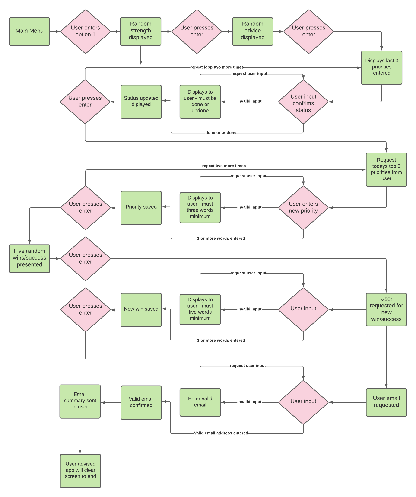

* Option 2 - Learn to use app Flow

 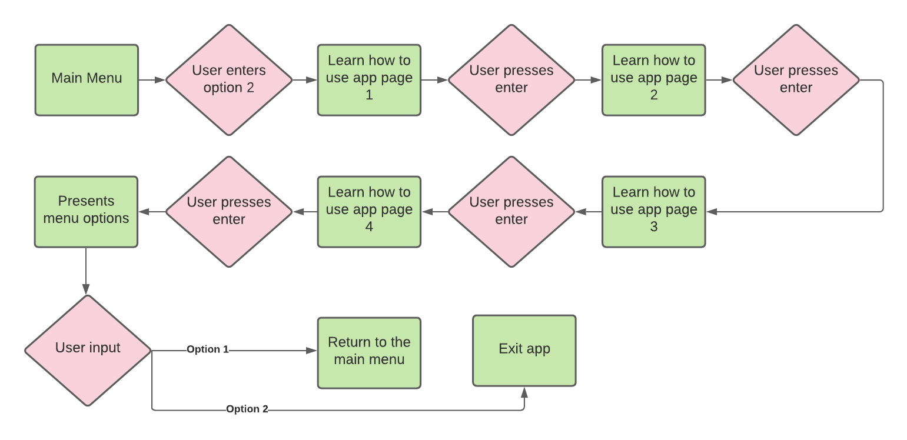

* Option 3 - Learn about ADHD Flow

 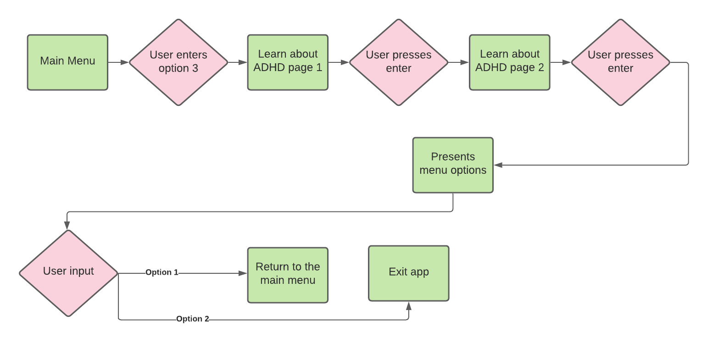

* Option 4 - Exit Flow

 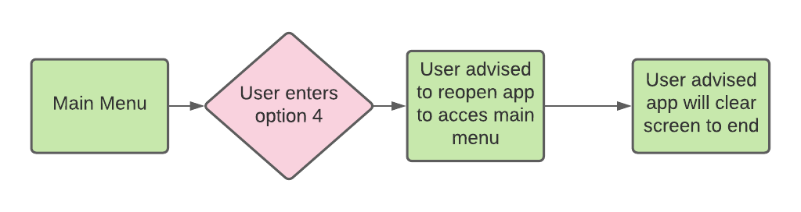

### Wireframes

* Main Menu

 

* Option 1 (Loading...)

 

 * Option 2 (Learn how to use app 1/2)

 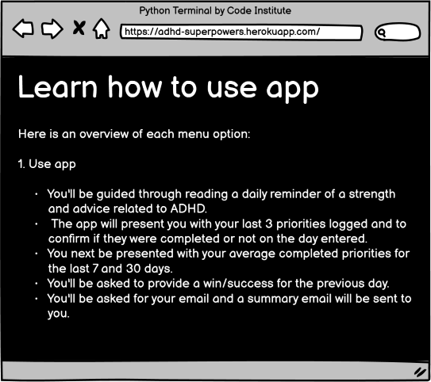

  * Option 2 (Learn how to use app 2/2)

 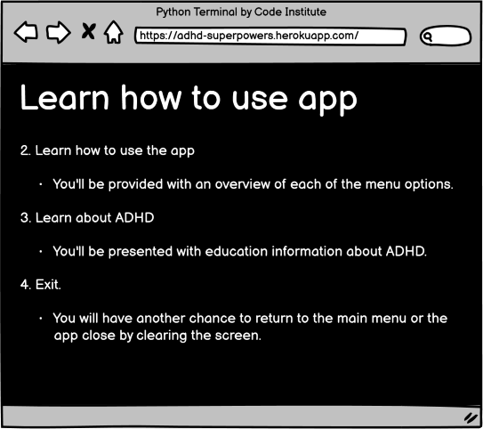

* Option 3 (Learn about ADHD 1/2)

 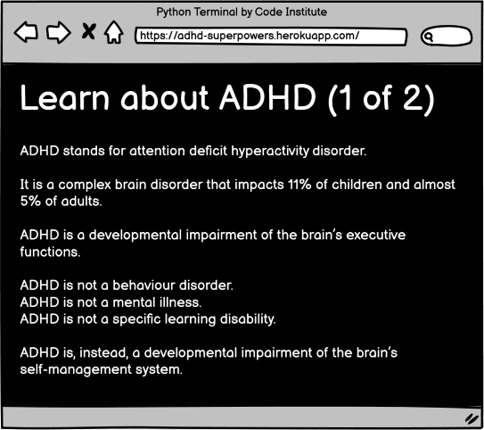

* Option 3 (Learn about ADHD 2/2)

 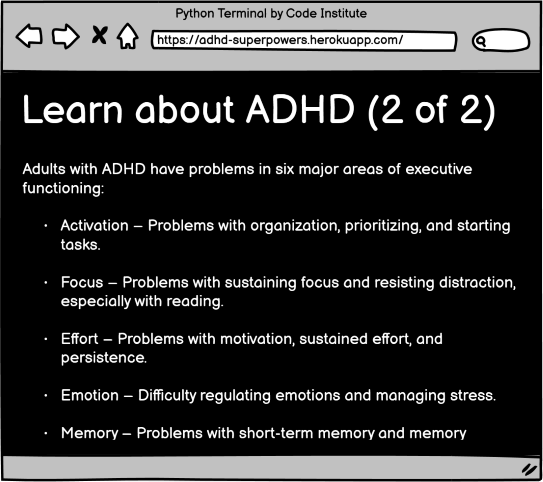

* Option 4 (Exit app)

 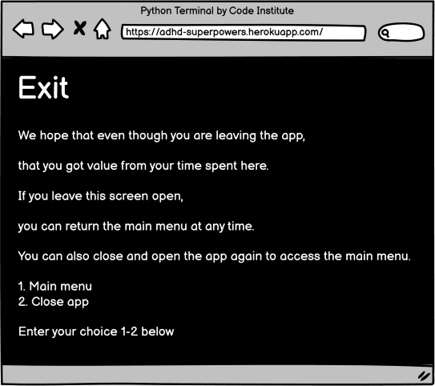
 
### Feaures

* Main Menu

 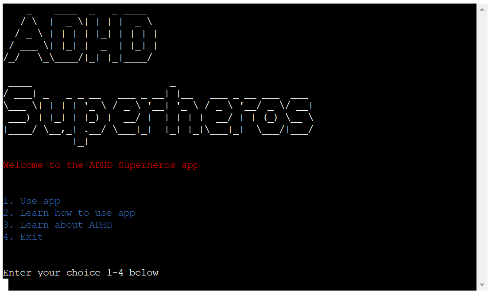

* Option 1 - Use App - Strength Reminder

 

* Option 1 - Use App - Advice Reminder

 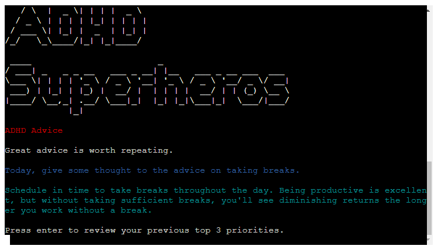

* Option 1 - Use App - Past Priority Review
    - Screen repeats two more times to get status. 

 

* Option 1 - Use App - Add today's top 3 priorities

 

* Option 1 - Use App - Show 5 previous wins/successs

 

* Option 1 - Use App - Enter new win/success

 

* Option 1 - Use App - Weekly report

 

* Option 1 - Use App - Monthly report

 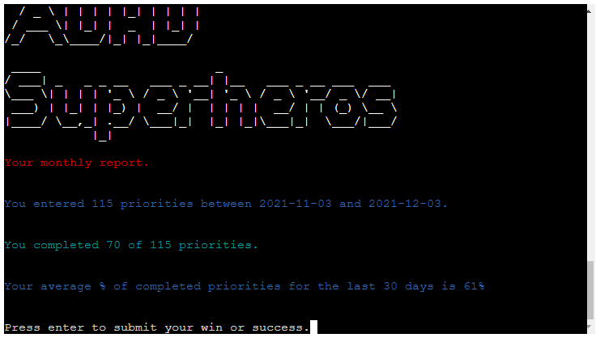

* Option 1 - Use App - Get email address from user

 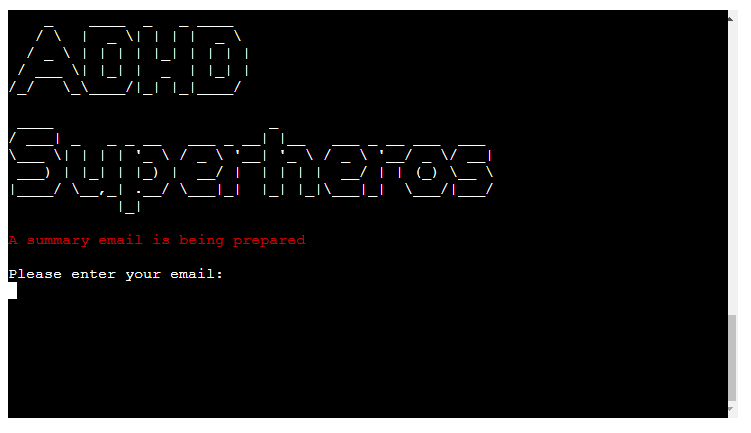

* Option 1 - Use App - Email summary report

 

* Option 2 - Learn to use app (five screens/pages)
    - Note that at the end of this menu option, the user is presented to either return to main menu or exit

 

 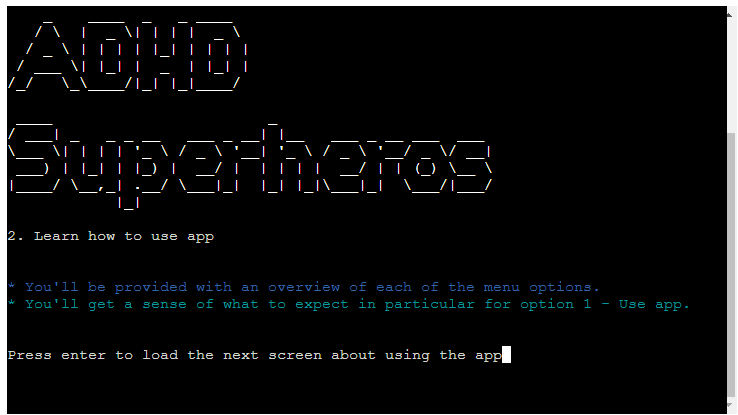

 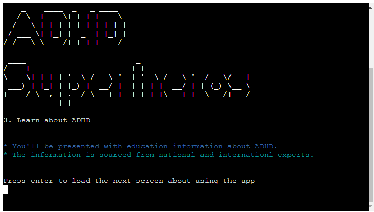

 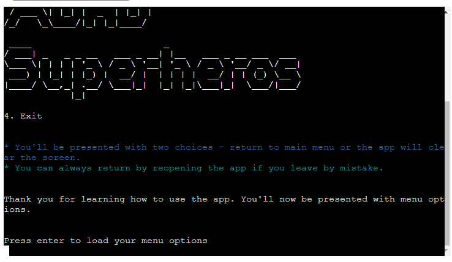

 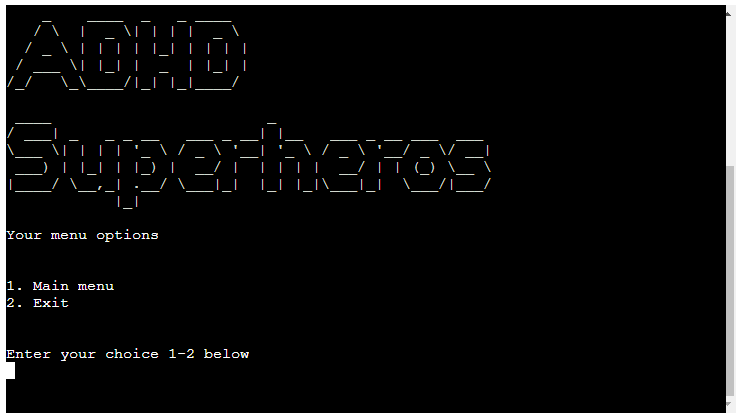

* Option 3 - Learn about ADHD (three screens/pages)
    - Note that at the end of this menu option, the user is presented to either return to main menu or exit

 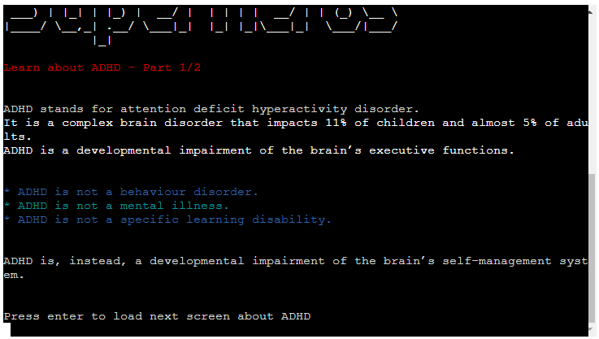

 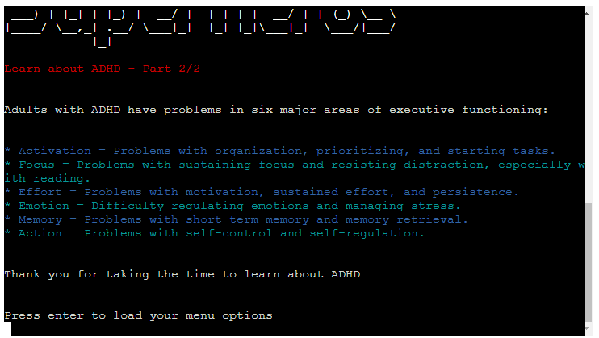

 

* Option 4 - Exit app

 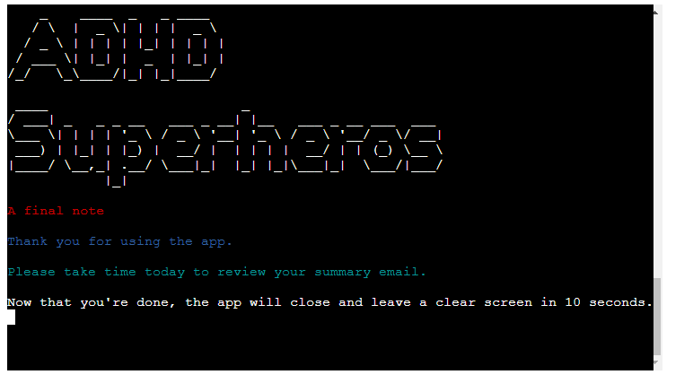

## Technologies

### Languages Used

* [Python](https://www.python.org/)

### Libraries and Programs Used

#### Programs Used

* [Git](https://www.atlassian.com/git) - used for branching, merging, and rewriting repository history.

* [GitHub](https://github.com/) - used a hosting service for Git repositories.

* [GitHub Projects Board](https://github.com/declanosullivan/ADHD-Superheros/projects/1) - used as kanban to-do list for tracking issues and feature progress.
    - 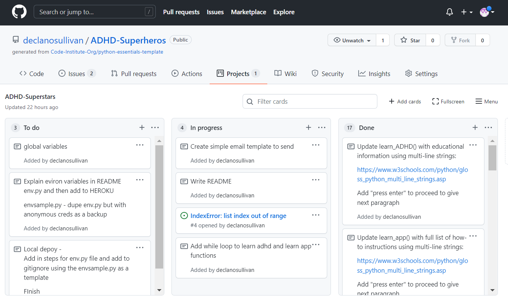

* [Gitpod](https://gitpod.io/) - used as a workspace for Git repositories.

* [Google Sheets](https://www.google.com/sheets/about/) - used to store user information (wins, strengths, priorities).

* [Heroku](https://www.heroku.com/) - used to deploy project. 

* [Lucidchart](https://www.lucidchart.com/) - used to create flow charts. 

* [Am I responsive](http://ami.responsivedesign.is/) - used to generate responsive mockup image at the top/beginning of the README.

* [Microsoft Photos](https://www.microsoft.com/en-us/p/microsoft-photos/9wzdncrfjbh4?) - used to resize images.

* [Grammarly](https://www.microsoft.com/en-us/p/microsoft-photos/9wzdncrfjbh4?) - used to ensure documentation is clear and correct.

* [Canva](https://www.canva.com/) - used to create email header.

#### Libraries Used

* [Gspread](https://docs.gspread.org/en/v4.0.1/) - used API to enable Python to access google sheets. 

* [Time](https://docs.python.org/3/library/time.html) - used create pauses (in seconds) between print statements. 

* [Os](https://docs.python.org/3/library/os.html) - used to create a function that clears the screen for the user. 

* [Datetime](https://docs.python.org/3/library/datetime.html) - used to create calculations of date ranges in functions.

* [Pyfiglet](https://pypi.org/project/pyfiglet/0.7/) - used to render a string as an ASCII text. 

* [Colorama](https://pypi.org/project/colorama/) - used to add color to text styling of print statements.

* [Smtplib](https://docs.python.org/3/library/smtplib.html) - used to create a function that sends email.

## Testing

For all testing documentation, please refer to [TESTING](TESTING.md)

## Deployment

### Local Deployment

To make a local copy of this repository, you can type the following into your IDE terminal:

- `git clone https://github.com/declanosullivan/ADHD-Superheros.git`

Alternatively, if using Gitpod, you can click below to create your own workspace using this repository.

[](https://gitpod.io/#https://github.com/declanosullivan/ADHD-Superheros)

Sending emails within this Python application:

Add in steps for ```env.py``` file and add to ```.gitignore``` using the [envsample.py](https://github.com/declanosullivan/ADHD-Superheros/blob/main/envsample.py) as a template

**NOTE**: If receiving errors while sending emails using this app, due to Google's security feature with **2-Factor Authentication**, **Less Secure Apps**, and **DisplayUnlockCaptcha**, you'll need to follow these steps.

- Turn **Off** [2-Factor Authentication](https://myaccount.google.com/signinoptions/two-step-verification/enroll-welcome)
- Turn **On** [Less Secure Apps](https://myaccount.google.com/lesssecureapps)
- Turn **On** [DisplayUnlockCaptcha](https://accounts.google.com/DisplayUnlockCaptcha)

To prevent a security breach, please create a secondary Google account for this purpose instead of using your existing personal Google account (to keep your existing Google account secure!). The sole purpose of this is for sending emails to the user from this application.

### Google Drive and Google Sheets APIs

Prerequisites.

- Before following these steps, you need to have a Google Drive account and an existing Google Sheet.
- You can create a Google Drive account [here](https://www.google.com/drive/).

Step 1 - Creating a project.

- In the Google Cloud Console Platform dashboard, click 'CREATE PROJECT' or click [here](https://console.cloud.google.com/projectcreate).
- Name the project and click the 'CREATE' button.
- You should now be on your new project's dashboard. 
- If not, you can access your project drop-down next to 'Google Cloud Platform'.

Step 2: Enable Google Drive API.

- From the sidebar, select 'API & Services' and then 'Library'.
- We will enable the 'Google Drive API first and then enable the 'Google Sheets API'.
- Search first for ['Google Drive API'](https://console.cloud.google.com/apis/library/drive.googleapis.com).
- Click the 'ENABLE' button. It may take a minute to enable the API.
- Once enabled, you should now see this API's Overview page. 

Step 3: Create Credentials.

- Click the ''CREATE CREDENTIALS' button.
- Select 'Google Drive API' from the 'Which API are you using?' drop-down.
- An additional question will appear - 'What data will you be accessing?'.
- Select 'Application Data'.
- An additional question will appear - 'Are you planning to use this API with Compute Engine, Kubernetes Engine, App Engine, or Cloud Functions?'.
- Select 'No, I'm not using them' and click the 'NEXT' button.
- Add name to 'Service account name' - it should be the same or similar to your project name.
- Role is optional, but set it to 'Editor', providing the account read and write permission. 
- The 'Grant users access to this service account' section is optional. Leave black and click the 'DONE' button.

Step 4: Create JSON key.

- You should now see the Credentials overview page. 
- Select your new Service account at the bottom of the page and click on the 'KEYS' tab.  
Click on the 'ADD KEY' drop-down, then 'Create new key', choose 'JSON' from key type, and click the 'CREATE' button.
- A JSON file will automatically download your local computer. Rename the file creds.json.

Step 5: Enable Google Sheets API.

- We will now enable the Google Sheets API, which has fewer steps. 
- From the sidebar of the Google Cloud Platform, select 'API & Services' and then 'Library'.
- Search for ['Google Sheets API'](https://console.cloud.google.com/apis/library/sheets.googleapis.com).
- Click the 'ENABLE' button. It may take a minute to enable the API.
- Once enabled, you should now see  to this API's Overview page. 

Step 6: Add Credentials File to Gitpod.

- Locate the JSON file from earlier that you renamed to creds.json.
- Open your Gitpod workspace and navigate to the Explorer tab.
- Drag and drop this file into your Gitpod workspace.
- Once uploaded, add creds.json to your .gitignore file to prevent it from syncing to Github. 
- This is to prevent the credentials in the creds.json file from being publically available on Github.  

Step 7 - Link spreadsheet to Google Cloud service account.

- From the creds.json file, copy the email address (without the quotation marks) after "client_email".
- Open the relevant Google Sheet and click the 'Share' button.
- Paste in the email address you copied from the creds.json file.
- Select 'Editor' from the drop-down, untick 'Notify' and 'Click Save'.

Step 8: Install Python libraries.

- In your terminal, type the following line to install all packages required for this application:

```shell
pip3 install -r requirements.txt
```
    
- Then enter, and the new dependencies installed are displayed in the terminal. 
- At the top section of your Python file (run.py), add `import gspread` underneath the last library listed. 
- On line under `import gspread`, add `from google.oauth2.service_account import Credentials`
- Add an empty line, and then on the next line, add the following:

```python
SCOPE = [ 
    "https://www.googleapis.com/auth/spreadsheets", 
    "https://www.googleapis.com/auth/drive.file", 
    "https://www.googleapis.com/auth/drive" 
    ]
```

- Add an empty line, and then on the next line, add the following four lines:

```python
CREDS = Credentials.from_service_account_file('creds.json') 
SCOPED_CREDS = CREDS.with_scopes(SCOPE) 
GSPREAD_CLIENT = gspread.authorize(SCOPED_CREDS) 
SHEET = GSPREAD_CLIENT.open('google_sheet_name_here')
```

- On the last line, update 'google_sheet_name_here' needs replaced with the **exact** name of your Google Sheet. 
- If the name does not match exactly, you will get the following error message:

```python
raise SpreadsheetNotFound gspread.exceptions.SpreadsheetNotFound
```

- Avoid renaming your Google Sheet. If you do, you'll need to update the name in your Python code again.

### Heroku Deployment

Prerequisites

- A Github repository 
- Your creds.json file open in Gitpod.
- Ensuring your requirements.txt is up to date. You can do so using by entering the following line in your terminal:

```
pip3 freeze --local > requirements.txt
```

Step 1 - Creating an account.

- If you already have a Heroku account, please sign in to your existing account.
- If you don't, go to [Heroku.com](https://www.heroku.com) and create a free account.

Step 2: Create an app.

- Click on the 'New' drop down in the upper right-hand corner.
- Select 'Create a new app'.
- When choosing an app name, it will need to be unique to Heroku.
- If the Github repository name or project name is not available, choose a name similar by adding other words, dashes, letters or numbers.
- Enter your chosen 'App name' and select your region.
- Click the 'Create app' button.

Step 3: Add Config Vars.

- Go to the 'Settings' tab in your app.
- Scroll down to the 'Config Vars' section and click the 'Reveal Config Vars' button.
- We are going to add two config vars.
- From the creds.json file, copy the entire contents.
- Enter `CREDS` for KEY and then paste the contents from creds.json into the VALUE field.
- Then click the 'Add' button. 
- Enter `PORT` for KEY and then `8000` for VALUE and click the 'Add' button.

Step 4: Add Buildpacks.

- On the same 'Settings' tab in your app, scroll down to the 'Buildpacks' section. 
- The buildpacks need to be listed in your Settings in a specific order. 
- It's best to add Python first, click 'Save Changes and repeat for then Node.js.
- If the buildpacks don't appear with **Python** first and **Node.js** second, you change the order by dragging Python to the top. 

Step 5 - Select Github Deployment Method.

- Go to the 'Deploy' tab in your app.
- In the Deployment method' section,  select 'GitHub' and click 'Connect to GitHub'.
- Search for your Github repository name, which will create a list of repository names.
- Click the 'Connect' button, and your Heroku app will link to your Github repository.
- You can choose manual deploys for your app; click 'Deploy Branch' in the 'Manual Deploy' section.
- Once successfully deployed, a green tick will appear next to Deploy to Heroku
- Your app will not update/rebuild each time you push to Github, which will conserve your dyno hours in Heroku. 
- You will need to click 'Deploy Branch' each time you want the app to rebuild after pushing your changes to Github. 
- Or you can choose automatic deploys for your app, 
- Your app will update/rebuild each time you push to Github, which will not conserve your dyno hours in Heroku
- To access your deployed app, scroll to the top and click 'Open app'.

## Credits and Learning Experience

* Thanks to Tim Nelson, my CI mentor, for the great support through my third project and in particular guiding me through sending emails from Python:
    - [freeCodeCamp](https://www.freecodecamp.org/news/send-emails-using-code-4fcea9df63f/)
    - [StackOverflow](https://stackoverflow.com/a/17596848)
    - [StackOverflow](https://stackoverflow.com/q/16512592)
    - [StackOverflow](https://stackoverflow.com/a/8519646)

* ADHD Strengths, advice and information about the condition shared through app adopted from these articles in Additube Magazine:
    - [Positives of ADHD - 12 Amazing Superpowers](https://www.additudemag.com/slideshows/positives-of-adhd/)
    - [What Is ADHD? Meaning, Symptoms & Tests](https://www.additudemag.com/what-is-adhd-symptoms-causes-treatments/)
    - [ADHD in Adults](https://adhdireland.ie/for-adults/adhd-in-adults/)

* Thanks to Dave Horrocks for sharing a code block I've adopted to add random funtionality to the strenghts and advice functions.

```python
SHEET  = a_sheet # replace a_sheet with your accessed/authorized sheet
WORKSHEET = a_sheet.worksheet("name_of_worksheet")

#this line includes the heading row and doesn't account for Sheets rows starting at 1
row_count = len(WORKSHEET.col_values(1)) # counts all rows with data entries in col1
row_ref_start = row_count + 1 #accounts for Sheets rows starting at 1
​
#start the randrange at 1 if including heading row, 2 if not.
random_row = WORKSHEET.row_values(randrange(1, row_ref_start))
```

* Thanks to fellow Student Ivana Iles for sharing this resouce for adding emojis to the app code:
    - [Emojipedia - Home of Emoji Meanings](https://emojipedia.org/)

* Sample data of historical priorities adopted from this webiste:
    - [Free Task & To-Do List Template by Instagantt](https://instagantt.com/free-task-and-to-do-list-template-for-project-management)


### Content

### Media

### Acknowledgements