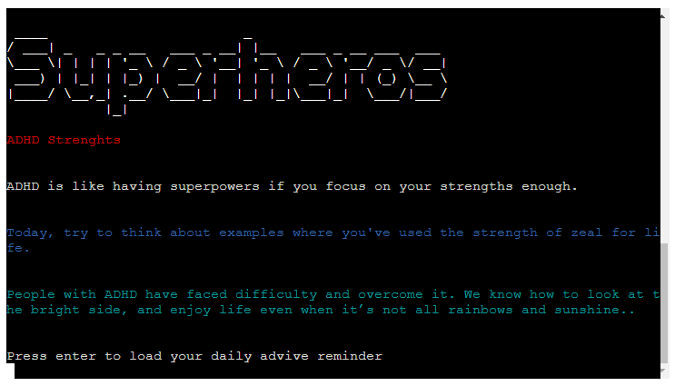
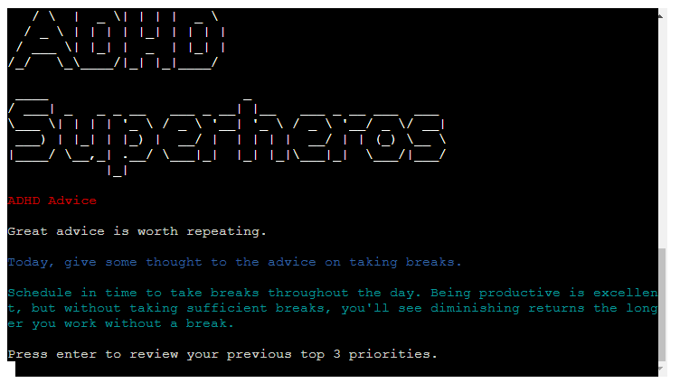
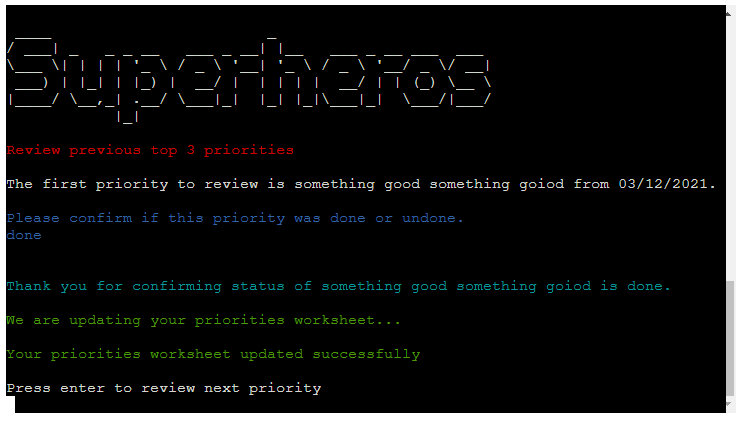
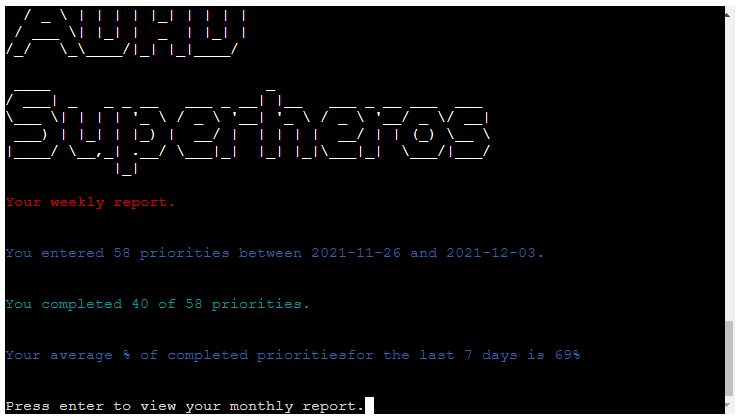
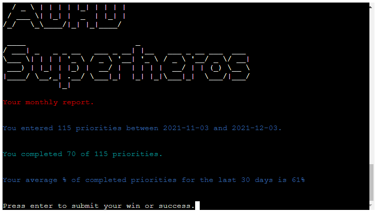
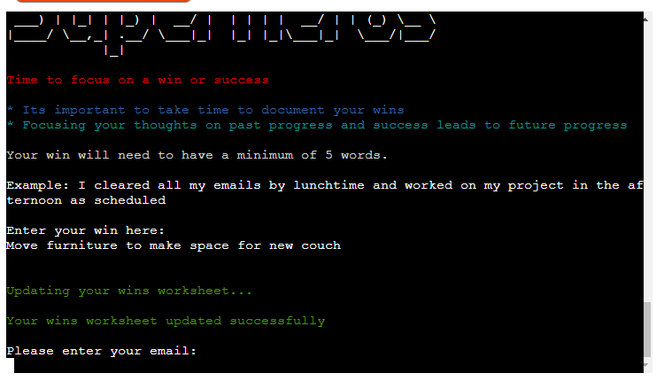
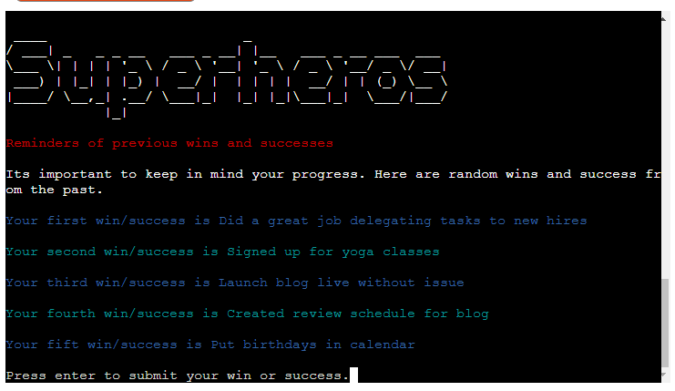
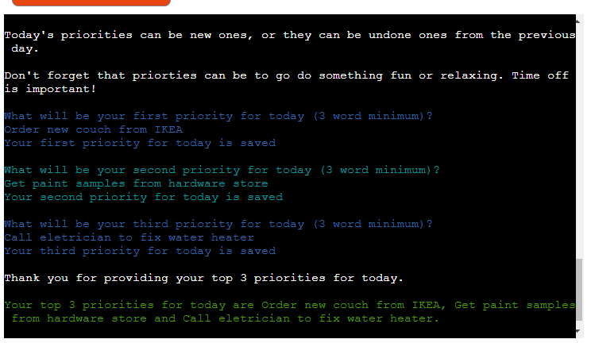
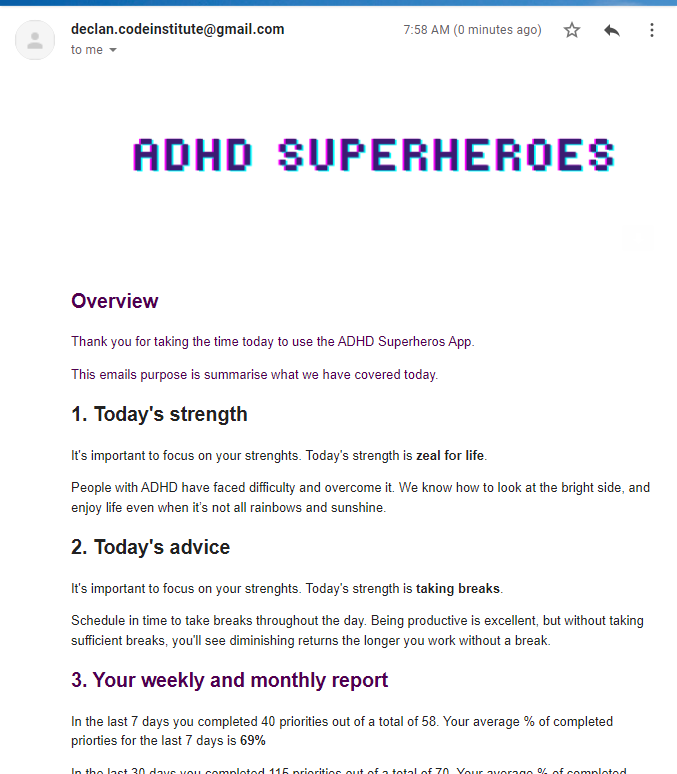

# Testing

Return to the [README](README.md)

### User Story Testing

* User Story 1: As a user, I need to see a daily reminder of an ADHD superpower/strength.

 

* User Story 2: As a user, I need to see a daily reminder of advice tailored to ADHDers.

 

* User Story 3: As a user, I need to review my top 3 priorities from yesterday day and confirm done/not done.

 

* User Story 4: As a user, I need a weekly % of my task completion (one week = 21 tasks, 16 done on the day = 76%). 

 

* User Story 5: As a user, I need a monthly % of my task completion (one month = 90 tasks, 79 done on the day = 86%).

 

* User Story 6: As a user, I need to document a win/success from yesterday.

 

* User Story 7: As a user, I need a reminder of 5 random wins/successes from previous days. 

 

* User Story 8: As a user, I need to set my top 3 priorities for the current day.

 

* User Story 9: As a user, I need an email summary of information shared while using the app.

 

## Bugs/Issues

I've used the [GitHub Issues](https://github.com/declanosullivan/ADHD-Superheros/issues) tracker for any bugs I encountered throughout the development stages of this application.

* **gspread.exceptions.APIError: {'code': 400,** - [#1](https://github.com/declanosullivan/ADHD-Superheros/issues/1)
* **No module named 'pyfiglet'** - [#2](https://github.com/declanosullivan/ADHD-Superheros/issues/2)
* **ZeroDivisionError: division by zero** - [#3](https://github.com/declanosullivan/ADHD-Superheros/issues/3)
* **Spreadsheet headers appearing in print statement outputs** - [#4](https://github.com/declanosullivan/ADHD-Superheros/issues/4)
* **IndexError: list index out of range** - [#5](https://github.com/declanosullivan/ADHD-Superheros/issues/5)

### Validators

All code passes PEP8 compliance. I used [pep8online](http://pep8online.com/) for code validation.
There was one minor issue with Line Too Long, which is due to the email image URL. I've included # noqa to avoid breaking the image URL so validation would ignore this one line.

 

### Compatibility

Chrome, Firefox etc with screenshots. 